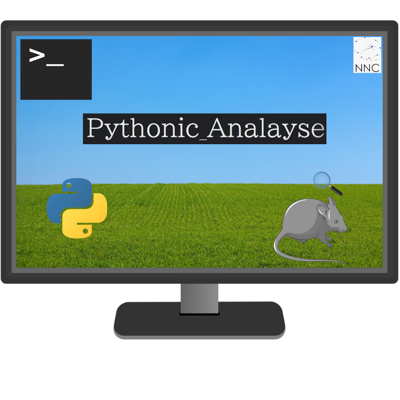

  [![Issues][issues-shield]][issues-url]
  [![GNU General Public License v3.0][license-shield]][license-url]

<!-- PROJECT LOGO -->
 

  

<h3 align="center">Pythonic_Analyze</h3>

  

    A port to Python of the MATLAB script created by Flávio Mourão in NNC
     
     
    ·
    <a href="https://github.com/mrdrzit/Pythonic_Analyze/issues">Report Bug</a>
    ·
    <a href="https://github.com/mrdrzit/Pythonic_Analyze/issues">Request Feature</a>
  

<!-- TABLE OF CONTENTS -->

  
Table of Contents

  <ol>
    <li>
      <a href="#about">About the project</a>
      <ul>
        <li><a href="#built-with">Built With</a></li>
      </ul>
    </li>
    <li>
      <a href="#getting-started">Getting Started</a>
      <ul>
        <li><a href="#prerequisites">Prerequisites</a></li>
        <li><a href="#installation">Installation</a></li>
      </ul>
    </li>
    <li><a href="#usage">Usage</a></li>
    <li><a href="#contributing">Contributing</a></li>
    <li><a href="#license">License</a></li>
    <li><a href="#contact">Contact</a></li>
    <li><a href="#acknowledgments">Acknowledgments</a></li>
  </ol>

<!-- ABOUT THE PROJECT -->
 

### About

- A port to Python of the MATLAB script created by Flávio Mourão in NNC

### Built With

* [Python](https://www.python.org/)
* [Qt Designer](https://doc.qt.io/qt-5/qtdesigner-manual.html)

 

<!-- GETTING STARTED -->
## Getting Started

### Prerequisites

- Coming in the near future...

### Installation
                                
- Coming in the near future...
 

<!-- USAGE EXAMPLES -->
## Usage
                                
- Coming in the near future...

 
                                
See the [open issues](https://github.com/mrdrzit/Pythonic_Analyze/issues) for a full list of proposed features (and known issues).

 

<!-- CONTRIBUTING -->
## Contributing

Contributions are what make the open source community such an amazing place to learn, inspire, and create. Any contributions you make are **greatly appreciated**If you have a suggestion that would make this better, please fork the repo and create a pull request. You can also simply open an issue with the tag "enhancement".

 
                                

<!-- LICENSE -->
## License

Distributed under the GNU General Public License v3.0. See `LICENSE.txt` for more information.

 

<!-- CONTACT -->
## Contact

João Pedro Carvalho Moreira - mcjpedro@gmail.com 
Matheus Costa - matheuscosta3004@gmail.com

 

<!-- ACKNOWLEDGMENTS -->
## Acknowledgments

* [Flávio Mourão](https://github.com/fgmourao)
* [Núcleo de Nuerociências](www.nnc.ufmg.br/)

### Developed at                                
Nucleo de Neurociencias - NNC 
Universidade Federal de Minas Gerais - UFMG 
Brazil 

<!-- MARKDOWN LINKS & IMAGES -->
[issues-shield]: https://img.shields.io/github/issues/mrdrzit/Pythonic_Analyze
[issues-url]: https://github.com/mrdrzit/Pythonic_Analyze/issues
[license-shield]: https://img.shields.io/github/license/mrdrzit/Pythonic_Analyze
[license-url]: https://github.com/mrdrzit/Pythonic_Analyze/blob/main/LICENSE.txt
